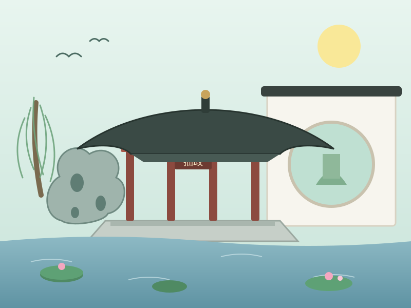

# 团队网站设计与制作报告

## 一、项目基本信息

| 项目 | 内容 |
| --- | --- |
| 网站主题 | 团队成员个人展示网站（团队页 + 4 个个人主页 + 共用职业技能页） |
| 团队成员 | 罗依婧（SA26225245）、徐世华（SA26225382）、徐文强（SA26225384）、王丰源（SA26225312） |
| 城市选题 | 苏州 |
| 开发方式 | 纯手工编写 HTML5 + CSS3，**未使用任何网页制作软件，未使用 Vue 等前端框架** |
| 页面数量 | 6 个网页 + 1 个外部样式表 + 15 张图片资源 |

### 文件结构

```
task1/
├── index.html              # 第一个页面：团队页面（内嵌 CSS）
├── profile-xiaoluo.html    # 罗依婧个人主页
├── profile-member2.html    # 徐世华个人主页
├── profile-member3.html    # 徐文强个人主页
├── profile-member4.html    # 王丰源个人主页
├── skills.html             # 职业技能页面（四人共用）
├── css/
│   └── style.css           # 外部 CSS 样式表（5 个页面共用）
└── images/                 # 头像 4 张 + 苏州城市图 3 张 + 爱好插画 8 张
```

---

## 二、要求 1：团队页面（index.html）

团队页面的全部样式采用**内嵌自定义 CSS**（写在该文件的 `<style>` 标签内），对应要求逐条说明如下。

### 2.1 团队成员姓名、学号与个人主页超链接

页面用 CSS Grid 排列四张成员卡片，每张卡片包含**头像（点击可跳转）、姓名、学号**，以及「个人主页」「职业技能」两个超链接。代码节选：

```html
<article class="member-card">
    <a href="profile-xiaoluo.html">
        
    </a>
    <h3>罗依婧</h3>
    <p class="sid">SA26225245</p>
    <div class="card-links">
        <a class="btn" href="profile-xiaoluo.html">个人主页</a>
        <a class="btn ghost" href="skills.html#xiaoluo">职业技能</a>
    </div>
</article>
```

其余三位成员（徐世华 SA26225382、徐文强 SA26225384、王丰源 SA26225312）结构完全相同，分别链接到各自的个人主页，**确保每位成员都有可访问的个人主页链接**。

### 2.2 苏州城市介绍：五个方面全覆盖

苏州介绍板块用文字完整覆盖了要求的五个方面，并用三张信息卡 + 四个小标题分区：

| 要求覆盖点 | 页面位置 | 关键内容 |
| --- | --- | --- |
| 地理位置 | 信息卡「地理位置」 | 江苏省东南部、长江三角洲中部、太湖东岸，京杭大运河纵贯，东接上海 |
| 人口 | 信息卡「人口规模」 | 常住人口约 1300 万（2023 年末约 1295.8 万） |
| 风景名胜 | 「风景名胜」段落 | 拙政园、留园、虎丘、寒山寺、平江路、山塘街、周庄同里甪直古镇、金鸡湖 |
| 文化 | 「文化底蕴」段落 | 2500 年建城史、昆曲、苏州评弹、苏绣、桃花坞年画、贝聿铭设计的苏博 |
| 美食 | 「苏式美食」标签组 | 松鼠桂鱼、响油鳝糊、苏式汤面、奥灶面、阳澄湖大闸蟹、桂花糖藕、鲜肉月饼、生煎馒头、碧螺春 |

### 2.3 城市风貌图片

插入了 **3 张**展示苏州风貌的图片：苏州园林、虎丘云岩寺塔、平江路水巷：

```html
<div class="city-gallery">
    <figure>
        <a href="https://baike.baidu.com/item/拙政园" target="_blank" rel="noopener">
            
        </a>
        <figcaption>拙政园为代表的苏州园林 —— 点击图片可跳转百科了解更多</figcaption>
    </figure>
    <!-- 虎丘、平江路两张图结构相同 -->
</div>
```

### 2.4 外部链接，且部分链接绑定在图片上

- **前两张城市图片本身包在 `<a>` 标签中**，鼠标悬停会出现「点击查看 ↗」提示，点击图片即在新标签页打开百度百科对应词条（拙政园、虎丘）；
- 页面底部另设「获取更多信息」文字外链区，共 3 个外部链接：

```html
<a href="https://baike.baidu.com/item/拙政园" target="_blank" rel="noopener">
              <!-- 链接直接绑在图片上 -->
</a>
...
<li><a href="https://www.suzhou.gov.cn" target="_blank" rel="noopener">苏州市人民政府官方网站</a></li>
```

所有外链均加了 **`target="_blank"`（新窗口打开）和 `rel="noopener"`（安全属性）**。

### 2.5 内嵌 CSS 选择器要求（4 类选择器全部具备且全部实际使用）

**① 共用选择器（一个规则同时选中两个及以上标签）——实际用于统一全站标题字体：**

```css
h1, h2, h3 {
    font-family: -apple-system, "Microsoft YaHei", "PingFang SC", sans-serif;
    font-weight: 700;
}
figure, ul { margin: 0; padding: 0; }   /* 第二个共用选择器 */
```

**② 类选择器——大量使用，例如成员卡片、按钮：**

```css
.member-card {
    background: #fff;
    border-radius: 12px;
    border: 1px solid #e8eaef;
    box-shadow: 0 1px 3px rgba(15,23,42,.04);
}
```

**③ 上下文选择器（设置嵌套在其他标签内部的标签样式）——例如只设置成员卡片内的头像：**

```css
.member-card img {            /* 只作用于 .member-card 里面的 img */
    width: 96px; height: 96px;
    border-radius: 50%;
    border: 3px solid #f1f5f9;
}
.city-gallery figcaption { ... }   /* 城市画廊内的图片说明文字 */
.more-links li a { ... }           /* 外链列表内的链接 */
```

**④ 为 `<a>` 标签设置鼠标悬浮 hover 效果——导航、按钮、图片链接、文字外链均有：**

```css
.topbar nav a:hover { color: #818cf8; border-bottom-color: #818cf8; }
.btn:hover { background: #4338ca; transform: translateY(-1px); }
.city-gallery a:hover img { transform: scale(1.05); }
.more-links li a:hover { color: #4338ca; border-bottom-color: #4338ca; }
```

以上定义的样式在页面正文里均有对应的 HTML 元素实际使用，**不存在"定义了却没用"的样式**。

### 2.6 多处行内 CSS 样式

直接写在元素 `style="…"` 属性里的行内样式有十余处，例如顶部标签、首字下沉、信息卡彩色顶边、9 个美食标签的独立配色：

```html
<span style="display:inline-block; background:rgba(129,140,248,.12); color:#a5b4fc;
             font-size:12px; padding:5px 16px; border-radius:6px;">软件学院 · 课程作业</span>

<span style="font-size:32px; font-weight:800; color:#6366f1; float:left;">苏</span>

<div class="fact" style="border-top:3px solid #6366f1;"> ... </div>

<span class="food-tag" style="color:#b45309; background:#fffbeb; border-color:#fcd34d;">松鼠桂鱼</span>
```

### 2.7 响应式设计

设置了 **900px（平板）和 600px（手机）两个断点**：电脑端成员卡片 4 列、城市图 3 列；平板变为 2 列 / 单列；手机端进一步缩小字号与头像尺寸。

```css
@media (max-width: 900px) {
    .team-grid { grid-template-columns: repeat(2, 1fr); }
    .city-gallery { grid-template-columns: 1fr; }
    .fact-grid { grid-template-columns: 1fr; }
}
@media (max-width: 600px) {
    .hero h1 { font-size: 28px; }
    .member-card img { width: 88px; height: 88px; }
}
```

---

## 三、要求 2：个人主页（4 个页面）

四个个人主页结构与规范一致，下文以**罗依婧主页**为主例，其余三人类似（姓名、学号、配色不同）。

### 3.1 内容要求

**① 本人照片、全名、学号**（顶部横幅，照片为圆形裁剪）：

```html

<h1>罗依婧</h1>
<p class="stu-id">学号：SA26225245</p>
```

**② 文字 + 图片展示个人背景、爱好、兴趣**（四位成员均无个人视频，按要求用"图片 + 文字"代替）：

每个主页都有「个人简介」信息列表（姓名 / 学号 / 家乡 / 班级 / MBTI）和「爱好与兴趣」图文双栏，例如罗依婧为球类运动 + Jazz 爵士舞两张配图；徐世华为健身撸铁 + 《星际穿越》主题图；徐文强为游泳 + 游戏；王丰源为摄影 + 旅行户外。

**③ 三个超链接全部具备**——电子邮箱（mailto 协议）、团队页面、职业技能页面：

```html
<a class="link" href="index.html">团队页面</a>
<a class="link" href="skills.html#xiaoluo">职业技能页面</a>
<a class="link" href="mailto:239065750@qq.com">电子邮箱</a>
```

四人邮箱分别为：239065750@qq.com、1816476469@qq.com、xwq3337@gmail.com、3081075021@qq.com。

**④ 清晰写明职业技能发展规划**（短期 + 长期双卡，详见本报告第五部分）。

### 3.2 样式规范 a)：外部 CSS 样式表（css/style.css，5 个页面共用）

**① 统一设置全部 `<p>` 段落标签样式：**

```css
p {
    font-size: 15px;
    color: #475569;
    line-height: 1.85;
    margin-bottom: 12px;
}
```

**② 通用类定义（可在多个元素上重复使用）**——`.card` 卡片类在每个主页上重复使用 4 次，`.tag` 标签类在技能页大量复用：

```css
.card {
    background-color: #ffffff;
    border-radius: 12px;
    padding: 32px 36px;
    border: 1px solid #e8eaef;
    box-shadow: 0 1px 3px rgba(15, 23, 42, 0.04);
}
```

**③ 标签限定类**（标签 + 类组合，只作用于 header 内部的标题）：

```css
.header h1 {
    font-size: 32px;
    font-weight: 700;
    letter-spacing: 2px;
    margin: 12px 0 4px;
}
```

**④ 专用于 `<a>` 标签的类，带鼠标悬浮效果：**

```css
a.link {
    font-weight: 500;
    color: #6366f1;
    border-bottom: 1px solid transparent;
    transition: color 0.2s ease, border-color 0.2s ease;
}
a.link:hover {
    color: #4338ca;
    border-bottom-color: #4338ca;
}
```

### 3.3 样式规范 b)：页面内部 `<style>` 内嵌 CSS（三种选择器全部具备）

每个个人主页的内嵌样式都包含以下三条，且主题色各有区分（靛蓝 / 紫 / 琥珀 / 翠绿）：

**① ID 选择器，用于设置字体样式：**

```css
#bio-text {
    font-family: Georgia, "Times New Roman", "宋体", serif;
    font-size: 16px;
    color: #475569;
}
```

**② 标题文本样式：**

```css
h2 {
    color: #1e293b;
    font-size: 20px;
    font-weight: 700;
    border-left: 3px solid #6366f1;
    padding-left: 14px;
}
```

**③ 上下文选择器样式（div.content 内部段落的行高）：**

```css
div.content p {
    line-height: 1.9;
}
```

### 3.4 个人主页响应式

外部样式表中设置 **768px（平板）和 480px（手机）断点**：规划双卡在窄屏变单列、画廊双图变单图、头像与字号逐级缩小，适配手机、平板、电脑三类设备：

```css
@media (max-width: 768px) {
    .plan-grid { grid-template-columns: 1fr; }
    .gallery { grid-template-columns: 1fr; }
}
@media (max-width: 480px) {
    .header h1 { font-size: 22px; }
    .avatar { width: 110px; height: 110px; }
}
```

---

## 四、职业技能页面（skills.html，四人共用）

### 4.1 硬技能与软技能清晰分区

页面按成员分四个锚点分区，每人内部再分**「硬技能（技术 / 专业能力）」和「软技能（人际 / 通用能力）」**两块。硬技能用进度条直观展示熟练度，软技能用彩色标签呈现：

| 成员 | 硬技能 | 软技能 |
| --- | --- | --- |
| 罗依婧 | Python（熟练 80%）、C 语言 65%、深度学习基础 45%、Agent 开发 40% | 团队协作、时间管理 |
| 徐世华 | C 语言 65%、C++ 35%、数据结构与算法 40% | 团队配合、时间管理、踏实肯学 |
| 徐文强 | Python 75%、Go 65%、Rust 55%、Git 80%、Linux 78% | 沟通能力良好、长期团队开发经历、动手实践 |
| 王丰源 | C++ 50%、算法基础 45%、大模型开发与算法 25% | 善于沟通、团队协作、时间管理 |

### 4.2 大量行内 CSS 美化

技能页的文字颜色、间距、字号、背景色、进度条宽度与渐变色**全部直接写在 HTML 元素的 style 属性中**，例如：

```html
<span style="font-weight:600; color:#1e293b; font-size:14px;">Python 编程</span>
<span style="color:#6366f1; font-weight:600; font-size:13px;">熟练 · 80%</span>
<div class="skill-fill" style="width:80%; background:linear-gradient(90deg,#818cf8,#6366f1);"></div>

<span class="tag" style="background:#eef2ff; color:#4338ca; border-color:#c7d2fe;">团队协作</span>
```

页面顶部还有四个成员快速跳转按钮（锚点导航 `#xiaoluo`、`#member2` …），并支持「返回顶部」。

---

## 五、四位成员职业技能发展规划

### 5.1 罗依婧（SA26225245）—— 方向：AI Agent 应用开发

- **短期目标（在校期间）**：系统学习深度学习基础理论与主流框架，同步掌握大模型应用与 Agent 开发技术栈，包括 **Prompt 工程、RAG 检索增强生成、工具调用（Function Calling）、多智能体协作、LangChain/LangGraph 等主流框架**；通过课程项目与开源实战积累完整的工程经验（数据处理、模型调用、评测与部署），争取拿到一份 **Agent 开发方向的实习 offer**。
- **长期目标（毕业后 3–5 年）**：持续深耕 AI Agent 与网络安全的交叉领域，成长为能够**独立负责项目从需求分析到落地上线全流程的 AI 应用开发工程师**；毕业后进入头部互联网大厂，拿到有竞争力的薪酬包，并向技术专家或技术管理方向持续进阶。

### 5.2 徐世华（SA26225382）—— 方向：量化交易 / 大模型算法

- **短期目标**：作为跨考上岸的学生，优先补齐计算机专业基础：系统学习 **C++、数据结构与算法**，同步巩固概率论、线性代数、数理统计等量化与算法必备的数学功底；坚持在 LeetCode 等平台刷题，通过课程项目和算法竞赛检验学习成果，为目标方向打好地基。
- **长期目标**：在**量化交易或大模型算法**两个方向中结合实习体验确定主线，成长为兼具**数学建模能力与工程实现能力**的算法工程师，能够用模型和数据解决真实业务问题（策略回测、因子挖掘或大模型训练与调优）。

### 5.3 徐文强（SA26225384）—— 方向：大模型算法 + 工程开发

- **短期目标**：认真学好专业课程，打好**大模型算法理论基础**——机器学习、深度学习、Transformer 与大模型原理；同时提升 **Python / Go / Rust** 多语言工程开发的熟练度，熟练使用 Git、Linux；积极参与团队项目和开源实践，训练规范、可靠的工程编码能力。
- **长期目标**：成为一名**优秀的程序员**，能够熟练运用 AI 编程工具与大模型能力提升自身开发效率和竞争力，在大数据与人工智能领域持续成长，获得良好的职业发展与收入。

### 5.4 王丰源（SA26225312）—— 方向：C++ 后端开发（兼顾大模型）

- **短期目标**：尽快找到一份实习，**亲身了解真实的就业市场与工程开发流程**；目前主攻 C++ 后端开发岗位，夯实 C++ 语言、数据结构与算法、操作系统、计算机网络四大基础；同时主动了解大模型开发与算法的基本知识，拓宽技术视野，为方向选择提供依据。
- **长期目标**：在通过实习充分接触不同方向后，**选择一个方向坚持深耕**，持续积累工程经验与技术深度，成为该领域内能够解决复杂问题、具备核心竞争力的工程师。

---

